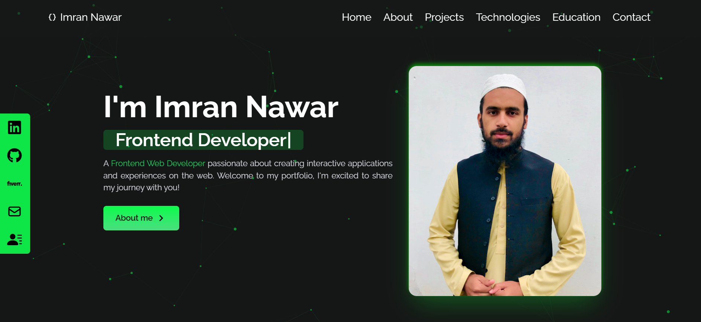
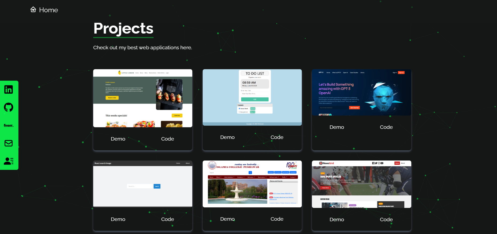

# Imran Nawar's portfolio - Computer Vision Researcher

Welcome to my portfolio! This repository showcases my professional journey as a Computer Vision Researcher. Here, you can download my resume and explore detailed information about my projects, technologies I work with, and more.

<!--  -->

<!--  -->

## 🚀 Sections

- Home
- About
- Experience
- Projects
- Technologies
- Education
- Contact
  

## 💻 Technologies Used
This portfolio is built with:

- React JS
- Tailwind CSS

### Libraries & Packages
- react-router-dom
- sweetalert2
- axios
- react-icons
- react-scroll
- tsparticles
- react-github-calendar

## 📝License

This project is licensed under the [License](LICENSE).
